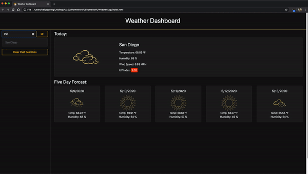

# 06 Server-Side APIs: Weather Dashboard

This application is a weather dashboard that will run in the browser and feature dynamically updated HTML and CSS using the [OpenWeather API](https://openweathermap.org/api) to retrieve weather data for cities. 

This project has been completed with no known bugs and can be viewed [here](https://kelly70ve.github.io/WeatherApp/). The project is responsive and can be viewed on mobile, tablet or desktop.

** This is my first attempt at a dark themed app!

--- 

## Project Goals

- The weather dashboard will search for the user inputed city
- Then the user is presented with current and future conditions for that city and that city is added to the search history
- When viewing current weather conditions for that city user is presented with the city name, the date, an icon representation of weather conditions, the temperature, the humidity, the wind speed, and the UV index
- When the user views the UV index they are presented with a color that indicates whether the conditions are favorable, moderate, or severe
- When the user views future weather conditions for that city they are presented with a 5-day forecast that displays the date, an icon representation of weather conditions, the temperature, and the humidity
- When the user clicks on a city in the search history they are again presented with current and future conditions for that city
- When the user opens the weather dashboard they are presented with the last searched city forecast

--- 

## Project Preview

- - -
© 2019 Trilogy Education Services, a 2U, Inc. brand. All Rights Reserved.
